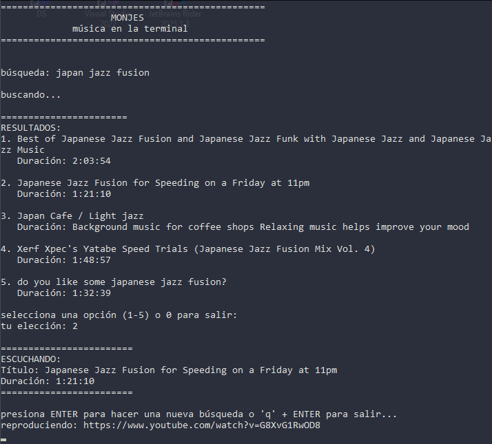

# MONJES

Reproductor de música por consola minimalista. Busca y reproduce música de YouTube sin descargas permanentes. Sólo es necesario saber que es lo que queremos escuchar.

## Descripción

Aplicación diseñada para escuchar música sin distracciones. Ideal para concentrarse mientras se trabaja, estudia o juega.



Características principales:
- Búsqueda directa en YouTube.
- Reproducción por streaming (sin descargas).
- Interfaz simple.
- Control básico de reproducción.

## Requisitos

- .NET 6.0 o superior.
- MPV (instalado y en PATH) (https://github.com/yt-dlp/yt-dlp).
- yt-dlp (instalado y en PATH) (https://github.com/mpv-player/mpv).
- Internet.

## Instalación

1. Clonar el repositorio
2. Verificar que MPV y yt-dlp estén instalados y accesibles
3. Compilar con `dotnet build`
4. Ejecutar con `dotnet run`

## Uso

1. Ingresa el término de búsqueda
2. Selecciona una canción de los resultados (1-5)
3. La música se reproduce automáticamente

### Controles durante reproducción

- `ENTER`: Nueva búsqueda
- `Q`: Salir de la aplicación
- `0`: Salir desde el menú de selección

## Arquitectura

```
MonjesMusicCLI/
├── Core/
│   ├── Models/
│   │   └── ResultadoBusqueda.cs
│   └── Services/
│       ├── YoutubeDlService.cs
│       └── MpvService.cs
├── UI/
│   └── ConsoleMenu.cs
├── Program.cs
└── MusicInCon.csproj
```

## Dependencias Externas

- **yt-dlp**: Búsqueda y obtención de URLs de YouTube
- **MPV**: Reproducción de audio por streaming

## Versión

v1.0 - Completada y funcional. La aplicación cumple con todos los objetivos establecidos para la versión inicial y está lista para uso.
